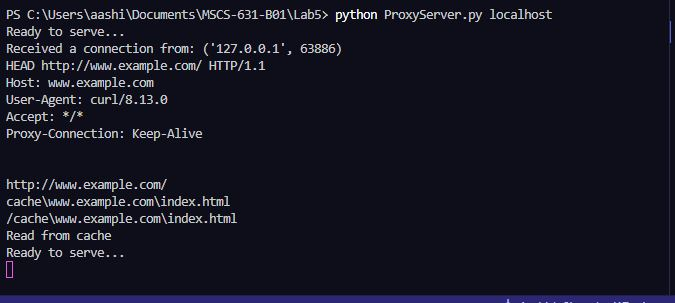
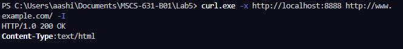
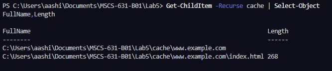

# Lab 5: HTTP Web Proxy Server

## Overview

A simple HTTP web proxy server that handles GET requests and caches responses locally. When a cached response exists, it is served directly from disk; otherwise, the proxy fetches the content from the origin server, caches it, and forwards it to the client.

## Files

| File / Folder     | Description                                            |
| ----------------- | ------------------------------------------------------ |
| `ProxyServer.py`  | Completed proxy server implementation                  |
| `img/`            | Screenshots verifying proxy and cache behavior         |
| `cache/`          | Cached origin responses (for example, `cache/www.example.com/index.html`) |

## Requirements

- Python 3.x
- No external packages required (uses standard library only)

## Running the Proxy Server

```bash
python ProxyServer.py <server_ip>
```

**Example (local machine):**

```bash
python ProxyServer.py localhost
```

The proxy listens on port **8888** by default.

## Usage

### Quick Command-Line Test

With the proxy running, issue a request through the proxy:

```bash
curl.exe -x http://localhost:8888 http://www.example.com/
```

### Configure Browser Proxy Settings

Set your browser's HTTP proxy to:

- **Host:** `localhost` (or the machine's IP if on a separate host)
- **Port:** `8888`

Then navigate to any HTTP URL normally (e.g., `http://www.example.com`).

## How Caching Works

1. The proxy parses the hostname from the incoming GET request.
2. It checks for a local cache file under `cache/<host>/<path>`.
3. **Cache hit:** Responds immediately with the cached content (`HTTP/1.0 200 OK`).
4. **Cache miss:** Opens a TCP connection to the origin server on port 80, fetches the full response, writes it to disk (root path is stored as `index.html`), and forwards it to the client.

## Notes

- Only HTTP (port 80) is supported; HTTPS is not handled.
- Cache files are stored under `cache/`, mirroring host and path (e.g., `cache/www.example.com/index.html`).
- Designed for educational use; not intended for production deployment.

## Screenshots

### Proxy Startup & First Request (Cache Miss)



The proxy binds to port 8888, accepts the client's TCP connection, parses the GET request, forwards it to the origin server on port 80, and returns `HTTP/1.0 200 OK` with the full response body.

### Second Request (Cache Hit)



The identical request is re-issued immediately. The proxy logs `Read from cache` and serves the response directly from disk — no round-trip to the origin server.

### Cache File on Disk (`cache/www.example.com/index.html`)



The cached response is written under `cache/` (for example, `cache/www.example.com/index.html`) after the first fetch and reused for all subsequent requests to the same host/path.

```text
PS C:\Users\aashi\Documents\MSCS-631-B01\Lab5> python ProxyServer.py localhost
Ready to serve...
Received a connection from: ('127.0.0.1', 63886)
HEAD http://www.example.com/ HTTP/1.1
Host: www.example.com
User-Agent: curl/8.13.0
Accept: */*
Proxy-Connection: Keep-Alive


http://www.example.com/
cache\www.example.com\index.html
/cache\www.example.com\index.html
Read from cache
Ready to serve...
Received a connection from: ('127.0.0.1', 63900)
HEAD http://www.example.com/ HTTP/1.1
Host: www.example.com
User-Agent: curl/8.13.0
Accept: */*
Proxy-Connection: Keep-Alive


http://www.example.com/
cache\www.example.com\index.html
/cache\www.example.com\index.html
Read from cache
Ready to serve...

PS C:\Users\aashi\Documents\MSCS-631-B01\Lab5> curl.exe -x http://localhost:8888 http://www.example.com/ -I   
HTTP/1.0 200 OK
Content-Type:text/html

PS C:\Users\aashi\Documents\MSCS-631-B01\Lab5> Get-ChildItem -Recurse cache | Select-Object 
FullName,Length   
   
FullName                                                                    Length
--------                                                                    ------
C:\Users\aashi\Documents\MSCS-631-B01\Lab5\cache\www.example.com
C:\Users\aashi\Documents\MSCS-631-B01\Lab5\cache\www.example.com\index.html 268
```