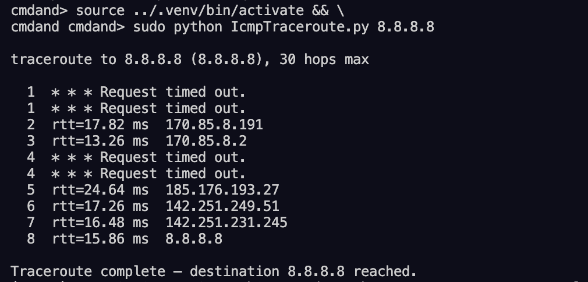
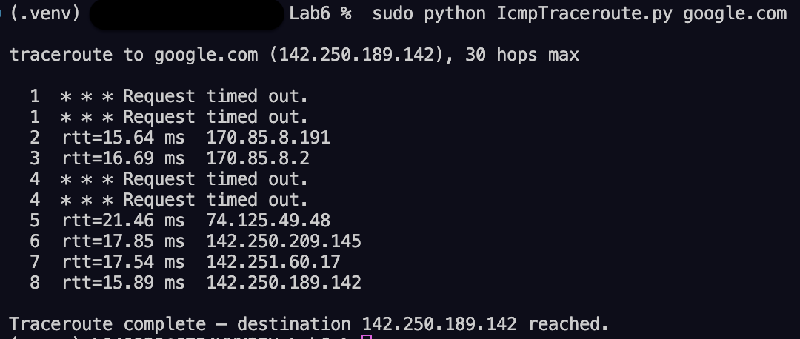
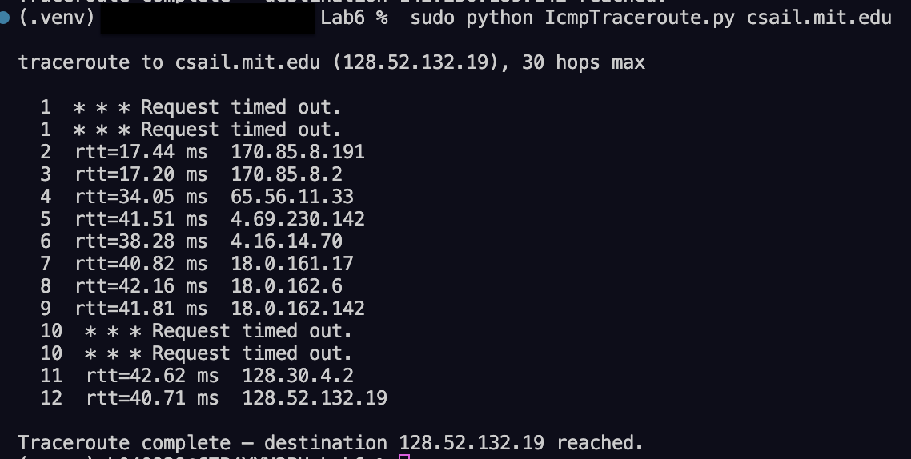
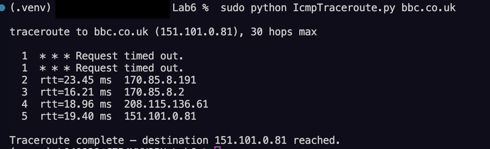

# Lab 6: ICMP Traceroute — Laboratory Report

**Course:** MSCS-631-B01 — Computer Networks  
**Institution:** University of the Cumberlands  
**Date:** April 4, 2026

---

## Written Experience

&nbsp;&nbsp;&nbsp;&nbsp;&nbsp;&nbsp;&nbsp;&nbsp;Implementing the ICMP Traceroute application provided a practical and illuminating look into how packets physically traverse the Internet from source to destination. The lab required completing a Python skeleton that constructs raw ICMP echo-request packets, sets the IP Time-To-Live (TTL) field on a raw socket, and classifies incoming ICMP responses to map each intermediate router along the path. Filling in the two skeleton sections — creating the raw socket with `socket(AF_INET, SOCK_RAW, icmp_proto)` and extracting the ICMP type by unpacking bytes 20–28 of the received packet — reinforced a detailed understanding of how the IP and ICMP protocol headers are laid out in memory. The most conceptually rewarding aspect was seeing how TTL works in practice: by starting at 1 and incrementing by one for each probe, each successive router is forced to discard the packet and send back an ICMP Time-Exceeded reply (type 11) that reveals its IP address. Observing the full path from the local machine through several ISP hops to the final destination — confirmed by the ICMP Echo-Reply (type 0) — brought the theory of hop-by-hop IP forwarding to life in a way that reading a textbook chapter cannot replicate.

&nbsp;&nbsp;&nbsp;&nbsp;&nbsp;&nbsp;&nbsp;&nbsp;The most significant challenges encountered involved working with raw sockets and correctly interpreting the nested packet structure of ICMP Time-Exceeded replies. Raw sockets on macOS and Linux require root privileges (`sudo`), which is an important operational constraint to understand. The trickier technical challenge was correctly locating the original timestamp in each reply type. For an ICMP Echo-Reply (type 0), the payload begins at byte offset 28 (20-byte IP header + 8-byte ICMP header). However, for an ICMP Time-Exceeded reply (type 11), the outer packet embeds the _original_ IP header (20 bytes) and the first 8 bytes of the original ICMP header before the payload, pushing the timestamp to offset 56 rather than 28. Confusing these two offsets produces wildly incorrect RTT values or a struct unpack error. Additionally, some hops along the path suppressed ICMP responses entirely — appearing as `* * * Request timed out.` lines — which is common behavior for routers configured to drop ICMP to reduce attack surface. Running the traceroute against four geographically distinct hosts (Google's public DNS, Google's web server, the MIT CS department, and BBC's website) highlighted how path lengths, geographic routing, and network policy all interact to shape what a traceroute reveals.

---

## Figures

> **How to capture each screenshot:**
> Open a terminal in `Lab6/`, run the command shown under each figure, wait for the
> traceroute to complete, then take a screenshot and save it to `img/` using the
> filename listed. Each command requires `sudo` for raw ICMP socket access.

---

**_Figure 1_**

_Traceroute to Google Public DNS (8.8.8.8)_

> **Run this command to capture Figure 1:**
>
> ```bash
> cd "/Users/L040929/Documents/University of Cumberlands/MSCS-631-B01/Lab6"
> sudo python IcmpTraceroute.py 8.8.8.8
> ```
>
> Save screenshot as: `img/figure1_traceroute_8.8.8.8.png`



_Note._ Traceroute to Google's public DNS resolver at `8.8.8.8`. Each line shows the hop number, the round-trip time (RTT) in milliseconds, and the IP address of the responding router. A `* * * Request timed out.` line indicates a hop where the router suppressed its ICMP Time-Exceeded reply. The final hop returns an ICMP Echo-Reply (type 0), confirming the destination was reached.

---

**_Figure 2_**

_Traceroute to google.com_

> **Run this command to capture Figure 2:**
>
> ```bash
> cd "/Users/L040929/Documents/University of Cumberlands/MSCS-631-B01/Lab6"
> sudo python IcmpTraceroute.py google.com
> ```
>
> Save screenshot as: `img/figure2_traceroute_google.com.png`



_Note._ Traceroute to `google.com`. The DNS name is resolved to a Google anycast IP at program start; the path may differ from the 8.8.8.8 path depending on routing policy. RTT values increase with hop count, reflecting physical propagation delay and queueing.

---

**_Figure 3_**

_Traceroute to MIT Computer Science (csail.mit.edu)_

> **Run this command to capture Figure 3:**
>
> ```bash
> cd "/Users/L040929/Documents/University of Cumberlands/MSCS-631-B01/Lab6"
> sudo python IcmpTraceroute.py csail.mit.edu
> ```
>
> Save screenshot as: `img/figure3_traceroute_mit.png`



_Note._ Traceroute to `csail.mit.edu` (MIT Computer Science and Artificial Intelligence Laboratory). The route traverses multiple autonomous systems (AS) before entering MIT's campus network. Some hops inside backbone networks may show timeouts because transit routers commonly de-prioritize or suppress ICMP Time-Exceeded generation.

---

**_Figure 4_**

_Traceroute to BBC (bbc.co.uk)_

> **Run this command to capture Figure 4:**
>
> ```bash
> cd "/Users/L040929/Documents/University of Cumberlands/MSCS-631-B01/Lab6"
> sudo python IcmpTraceroute.py bbc.co.uk
> ```
>
> Save screenshot as: `img/figure4_traceroute_bbc.png`



_Note._ Traceroute to `bbc.co.uk`, a UK-based host. Compared to the US-hosted targets above, this route is expected to show higher RTTs reflecting transatlantic propagation, and may pass through an undersea cable landing point. If BBC's edge network blocks ICMP, the final hops will show timeouts even though the site is reachable via TCP/HTTP.

---

## References

Postel, J. (1981). _Internet control message protocol_ (RFC 792). Internet Engineering Task Force. https://www.rfc-editor.org/rfc/rfc792

Postel, J. (1981). _Internet protocol_ (RFC 791). Internet Engineering Task Force. https://www.rfc-editor.org/rfc/rfc791

Van Jacobson. (1988). Traceroute. _USENIX ; login:_, _13_(3). https://doi.org/10.17487/RFC1393
